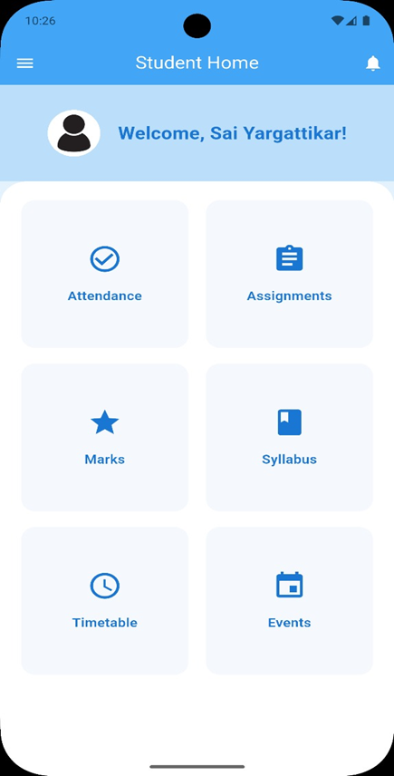
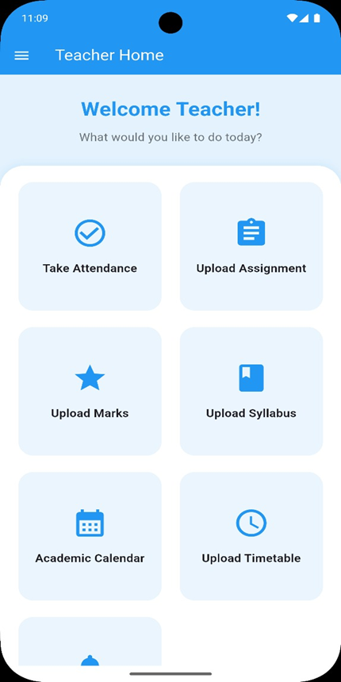
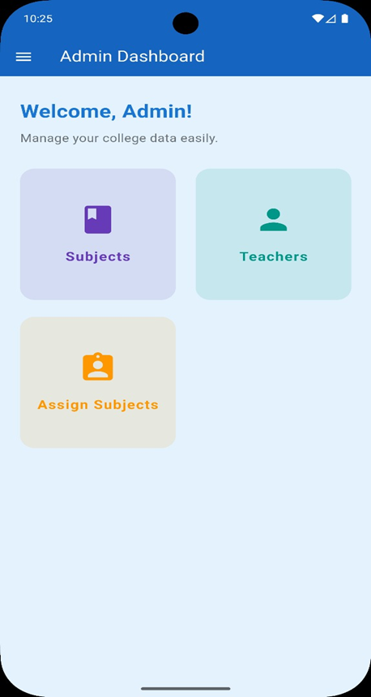

<div align="center">

# PresentX

An all‑in‑one educational management app connecting Students, Teachers, and Admins.

<br/>

[](https://flutter.dev)
[](https://dart.dev)
[](https://firebase.google.com)
[](https://supabase.com)
[](#)

</div>

---

## Overview

PresentX streamlines attendance, grades, timetable, syllabus, and announcements into a single Flutter app so institutions can save time and stay organized.

## Features

### Student
- Dashboard with upcoming items and notifications
- Attendance tracking
- Grade viewing and progress
- Assignment submissions and status
- Timetable and syllabus access

### Teacher
- Attendance recording and management
- Grade entry and updates
- Create assignments and share materials
- Manage timetable and syllabus
- Send announcements/notifications

### Admin
- Manage users (students, teachers)
- Manage subjects/courses
- Monitor system usage

## Screenshots

> Sample UI from the app (assets included in this repo)

| Student | Teacher | Admin |
| --- | --- | --- |
|  |  |  |

## Tech Stack
- Flutter (Dart)
- Firebase: Authentication, Firestore, Storage
- Supabase

## Getting Started

### Prerequisites
- Flutter SDK and Dart installed
- Android Studio or VS Code with Flutter extensions
- Firebase project
- Supabase project

### Setup
1) Clone and enter the project
```bash
git clone https://github.com/yourusername/present_x.git
cd present_x
```

2) Install dependencies
```bash
flutter pub get
```

3) Configure environment variables in a `.env` file (see below)

4) Run the app
```bash
flutter run
```

### Environment Variables
Create a `.env` file in the project root:
```env
# Firebase
FIREBASE_API_KEY=your_firebase_api_key
FIREBASE_APP_ID=your_firebase_app_id
FIREBASE_MESSAGING_SENDER_ID=your_firebase_messaging_sender_id
FIREBASE_PROJECT_ID=your_firebase_project_id
FIREBASE_STORAGE_BUCKET=your_firebase_storage_bucket

# Supabase
SUPABASE_URL=your_supabase_url
SUPABASE_ANON_KEY=your_supabase_anon_key
```

## Project Structure
```text
lib/
  admin/                # Admin features
  student/              # Student features
  teachers/             # Teacher features
  utils/                # Shared utilities/widgets
assets/
  images/               # App screenshots and illustrations
  icon/                 # Launcher icon
```

## Useful Commands
```bash
flutter clean
flutter pub get
flutter run -d chrome   # run on web
flutter build apk       # build Android APK
```

## Contributing
Contributions are welcome! Please open an issue or submit a PR.

## License
MIT License. See `LICENSE` for details.

## Contact
Questions or feedback? Email: [YOUR_EMAIL@example.com]
Developed by Rutuja

